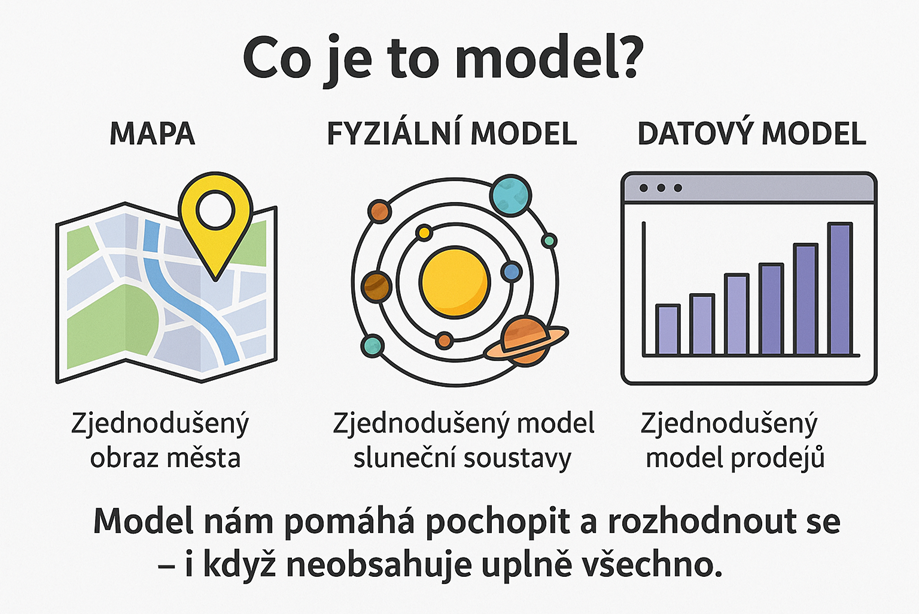
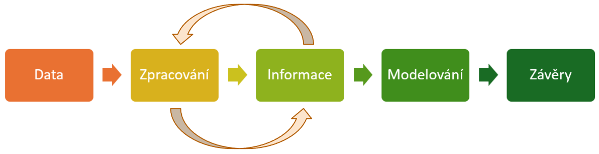

# Informační systémy

## Data a informace 

- **Příklad 1** : Na webu `www.databazeknih.cz` se vyskytují jak data, tak informace. Zkuste odhadnout, které z nich jsou **data** a které **informace**.
  
- **Příklad 2** : Přijdete do svého oblíbeného obchodu a u pokladny použijete svoji věrnostní kartičku – třeba proto, že sbíráte body na plyšáky nebo mají Colu v akci. Definujte co budou tvořit **data** a co **informace**.
 

**Další příklady:**
 
- Když si ráno zkontrolujete počasí na telefonu, díváte se na data – teplotu, vlhkost, rychlost větru, srážky. Všechna ta čísla a symboly jsou data. Když z nich zjistíte, že bude pršet, získali jste informaci. Můžete tak učinit nějaké rozhodnutí.
- Když hrajete hru, každý váš pohyb, každý bod, každý level – to jsou data. Když víte, kolik máte životů nebo jaké máte skóre, máte informace.

💡 Najděte další příklady...

==**Data a informace jsou dnes nové zlato**== 

Proč? Protože nám umožňují:

- **Rozumět světu kolem nás**:  Díky datům víme, jak se šíří nemoci, jak funguje ekonomika, nebo jak se mění klima.
- **Dělat lepší rozhodnutí**:  Firmy používají data k tomu, aby věděly, co se prodává, kde se vyplatí otevřít novou prodejnu, nebo jaké produkty vyvíjet. Data se využívají k rozhodování o dopravě, ve zdravotnictví nebo vzdělávání. I vy sami je používáte, když si vybíráte, co koupíte v obchodě, nebo kam pojedete na výlet.
- **Vytvářet nové věci a služby**:  Bez dat by neexistovaly chytré telefony s personalizovanými aplikacemi, streamovací služby, které vám doporučují filmy, ani online hry, které se přizpůsobují vašemu stylu.

**Příklady z reálného světa**:

- Jak Instagram ví, jaké reklamy vám ukázat?
- Jak Spotify ví, jakou hudbu vám doporučit?
- Jak funguje doprava, aby se snížily zácpy? 

Za vším jsou data, která jsou sbírána, analyzována a využívána k vytváření modelů, které nám pomáhají rozhodovat se a předpovídat pravděpodobný budoucí vývoj.

## Model 

Model je jednoduše zjednodušený popis reality.

- **Mapa města**: není to celé město, ale zjednodušený obraz, který nám pomáhá se orientovat.
- **Plánek školy**: zmenšená, schematická verze budovy, která ukazuje jen důležité věci.
- **Jízdní řád**: nepopisuje celý život dopravní společnosti, ale jen důležité časy a zastávky.
- **Tabulka výdajů** je model finanční situace rodiny – obsahuje jen vybrané položky a čísla.

Stejně jako mapa je model města, tak graf vývoje teplot je model počasí – ukazuje jen důležité body, aby se v nich dalo rychle vyznat.

**Jak to obvykle probíhá** (ne vždy všechny části):

Představte si, že umíte číst data jako detektivové. Dokážete z nich vyvozovat závěry, předpovídat, co se stane, a pomáhat lidem i firmám dělat lepší rozhodnutí. To je dovednost, která je v dnešním světě nesmírně cenná a bude se vám hodit, ať už se vydáte jakýmkoli směrem. 

## Shrnutí

Žijeme v digitálním věku, a ten se točí kolem dat. Každý den se na nás valí obrovské množství informací – z telefonů, počítačů, televize, sociálních sítí. A za všemi těmi informacemi jsou data.

- **Data jsou tedy surová fakta** : čísla, texty, obrázky, zvuky. Samy o sobě nic nesdělují.
- **Informace je pak to, co z dat vyčteme**, když je zpracujeme a dáme jim smysl. Můžeme činit závěry a rozhodnutí třeba i pomocí vhodných **modelů**. 
