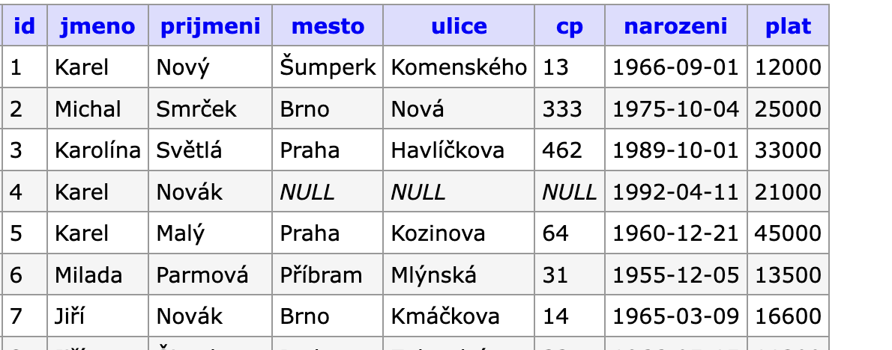

# Databázové systémy


Všechna sesbíraná data se musí někam ukládat. Pro malá data stačí uložit je do tabulky v tabulkovém kalkulátoru. I ten umí na slušné úrovni d daty pracovat. Má ale i své limity a nedostatky. Ten správný „domov“ pro data jsou databázové systémy. Těch je několik. Většina, zejména na webu fungují v modelu klient-server. My budeme pracovat s SQLite.


## SQLite
- SQLite je relační databázový systém šířený pod licencí Public Domain.
- Domovská stránka projektu: `www.sqlite.org`.
- SQLite je součástí mnoha systémů, např. prohlížeče Google Chrome, MS Edge i samotného Androidu.
- Databáze tvoří jeden soubor s příponou `.db`.
- Neobsahuje systém přístupových oprávnění jako „velké“ klient-server databáze (MySQL/MariaDB, PostgreSQL, MS SQL...).
- Databázi SQLite lze použít v jazycích C, C++, C#, Java, Lua, PHP, Python, Perl...
- Datové typy jsou velmi jednoduché na zvládnutí.
Formát databázových souborů je přitom nezávislý na operačním systému. SQLite tak představuje zajímavý a jednoduchý nástroj pro práci a analýzu dat.

## Editor

SQLite je primárně databáze klientská (jeden soubor = jedna databáze).

**DB Browser for SQLite**: https://sqlitebrowser.org (ten budeme používat).

---

My si nyní databázi a tabulku v aplikaci DB Browser for SQLite vytvoříme.

**Soubor se bude jmenovat `firma.db`.**

Čtyři důležité věci na úvod, kterým se databázové systémy odlišují od „tradiční“ tabulky v tabulkovém kalkulátoru:

1. Nejprve se vytvoří struktura tabulky – sloupce a jejich názvy.
2. Každý sloupec musí být jednoho datového typu (číslo, text...).
3. Jeden sloupec je vyhrazený pro tzv. primární klíč (jednoznačný identifikátor každého záznamu).
4. Teprve poté se tabulka může plnit daty.


## Datové typy

Všechny (skoro) databázové systémy jsou tzv. „typované“ – každý údaj musí být nějakého datového typu. „Velké“ systémy jich mívají několik desítek. Naopak SQLite jich má pouze pět:

1. `INTEGER` – Celá čísla (kladná i záporná). Ukládá se dynamicky (1–8 bajtů podle velikosti čísla).
2. `REAL` – Reálná čísla (např. `1.52`, `−0.22`, `3.14159`...). Velikost 8 bajtů.
3. `TEXT` – Textové řetězce. Kódování UTF-8. Délka není omezena.
4. `BLOB` – Binární data (např. obrázky, soubory).
5. `NUMERIC` – „Univerzální“ typ. SQLite se pokusí uložit hodnotu jako: `INTEGER`, `REAL` nebo `TEXT` (pokud to nevypadá jako číslo).

Pro běžné potřeby nám budou stačit dva: `INTEGER` pro celá čísla a `TEXT` pro text včetně kalendářního data i času. 

**Datum a čas**: Mezinárodní norma definuje pouze jeden tvar:

```
YYYY-MM-DD
HH:MM:SS
```
Jak pro datum, tak čas se používá datový typ `TEXT`, neboť obsahuje znaky `-` a `:`. Pro výběr údajů slouží funkce `strftime("%X", "hodnota")`.

# Tabulka `lide` k vytvoření




Názvy databází, tabulek a polí musí být bez diakritiky a mezer!

1. Spusťte aplikaci **DB Browser (SQLite)** a klepněte na **New Database**.
2. Zadejte název souboru (`firma`) a uložte např. na Plochu. Přípona `.db` se přidá sama.
3. Do okna s definicí tabulky zapište její název `lide`.
4. Tlačítkem **Add** přidejte sloupec pojmenujte ho `id` a zatrhněte `PK` a `AI`.
5. Pokračujte přidáním dalších sloupců viz obrázek níže.
6. Uložte tlačítkem **OK**.

Ve spodní části okna je vidět kód jazyka SQL.

Nyní tabulku naplníme daty:

1. Klepněte na kartu **Browse Data** a ikonu **Vložit nový záznam do tabulky**. Tím se vlevo objeví řádek s hodnotami `NULL`.
2. Postupně klepejte do polí a zapište údaje z tabulky výše. Čísla v poli `id` nezapisujte, vyplní se sama. Stačí první dva záznamy.


## Integritní omezení

Pod tímto termínem se neskrývá nic složitého. Jde o **pravidla nastavená na úrovni databáze**, která zajišťují správnost a konzistenci dat v tabulkách. Chrání data před nesprávnými nebo neúplnými záznamy – např. aby nechybělo jméno uživatele nebo aby se neopakovalo stejné ID.

- `NN` – Hodnota nesmí být prázdná (`NOT NULL`). Např. uživatel musí mít vždy vyplněné jméno.
- `U` – Hodnota musí být jedinečná (`UNIQUE`). Např. e-mail nesmí mít dva různí uživatelé.
- `PK` – Primární klíč. Jednoznačně identifikuje každý záznam v tabulce. Je vždy automaticky `NOT NULL` a `UNIQUE`. Hodnota by se neměla znovu použít – „recyklovat“ (`PRIMARY KEY`).
- `AI` – Automatické zvyšování hodnoty (jen pro čísla). Používá se typicky u primárního klíče (`AUTOINCREMENT`).
- `Výchozí` – Výchozí hodnota, která se použije, pokud uživatel žádnou nezadá (`DEFAULT`).


Příklad:

```sql
CREATE TABLE uzivatele (
    id INTEGER PRIMARY KEY AUTOINCREMENT,
    jmeno TEXT NOT NULL,
    email TEXT UNIQUE,
    overeno INTEGER DEFAULT 0
);
```

V tomto příkladu:
- `id` se vyplňuje automaticky a jednoznačně identifikuje záznam,
- `jmeno` musí být vždy vyplněno,
- `email` se nesmí opakovat,
- `overeno` má výchozí hodnotu `0` ("ne").

---

Předchozí tabulku sklad můžeme vytvořit i pomocí těchto dvou příkazů:


Struktura tabulky:

```sql
CREATE TABLE "lide" (
	"id"	INTEGER,
	"jmeno"	TEXT,
	"prijmeni"	TEXT,
	"mesto"	TEXT,
	"ulice"	TEXT,
	"cp"	TEXT,
	"narozeni"	TEXT,
	"plat"	INTEGER,
	PRIMARY KEY("id" AUTOINCREMENT)
);
```

Vložení dat do tabulky:

```sql
INSERT INTO "lide" ("jmeno","prijmeni","mesto","ulice","cp","narozeni","plat") VALUES 
 ('Karel','Nový','Šumperk','Komenského','13','1996-09-01',32000),
 ('Michal','Smrček','Brno','Nová','333','1975-10-04',28000),
 ('Karolína','Světlá','Praha','Havlíčkova','462','1989-10-01',33000),
 ('Karel','Novák',NULL,NULL,NULL,'1992-04-11',21000),
 ('Karel','Malý','Praha','Kozinova','64','1980-12-21',45000),
 ('Milada','Parmová','Příbram','Mlýnská','31','1955-12-05',33500),
 ('Jiří','Novák','Brno','Kmáčkova','14','1985-03-09',46600),
 ('Jiří','Šimek','Praha','Zahradní','33a','1976-05-15',41200);
```

Všimni si dvou věcí:
1. Struktura tabulky a data se vkládají **odděleně**.
2. Text je v uvozovkách (`"` nebo `'`), čísla jsou bez. Položky se oddělují čárkou -- tedy úplně stejně, jako v Pythonu.

---

# 💾 Úkol

1. Zavřete databázi a smažte soubor `firma.db`.
2. Vytvořte novou databázi `eshop.db` a do pole na kartě **Execute SQL** vložte přiložený SQL dotaz. 
3. Spustíte jej ikonou s modrou šipkou ▶.
4. Podívejte se na kartu **Database Structure** -- bude tam tabulka sklad.
5. Podívejte se na kartu **Browse Data** -- budou tam. 

# SQL

SQL znamená **Structured Query Language** a jedná se o jazyk pro komunikaci s databází. Vývoj jazyka SQL (původně se nazýval SEQUEL) začal v 70. letech minulého století (společně s rozvojem relačních databází) a během svého vývoje se stal nutnou znalostí kohokoliv, kdo, byť i jen okrajově, s databází pracoval. Během svého vývoje se postupně standardizoval (standard SQL-86, SQL-92, SQL-99). Standardy tedy existují a podporuje je prakticky každá relační databáze. Bohužel ne každá implementuje všechny. Téměř každá si přidává vlastní konstrukce, které nejsou součástí standardu.

SQL se pro jednotlivé databáze se lehce liší. Hovoříme o různých dialektech jazyka SQL. 

Jazyk SQL slouží k jakékoliv činnosti, které se v databázích provádí, například:

- **Definice**: Vytváření a změna struktury databází a tabulek (`CREATE`, `ALTER`).
- **Dotazování**: Vyhledávání dat v databázi pomocí příkazu `SELECT`.
- **Manipulace s daty**: 
  - vkládání (`INSERT`), 
  - aktualizace (`UPDATE`) a 
  - mazání (`DELETE`).
- **Řízení přístupu**: Nastavení uživatelských oprávnění (`GRANT`, `REVOKE`). Toto SQLite nemá.
- ...a mnoha dalším věcem.

