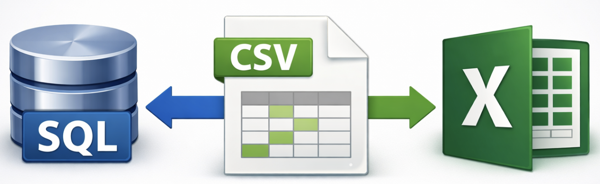

# Import a export a dat

## Formát CSV
Při práci s databázemi často potřebujeme data rychle přenést z tabulkového kalkulátoru (Excel) nebo naopak vyexportovat z databáze pro další zpracování. Nejjednodušší a univerzálně použitelnou metodou je přenos dat pomocí schránky (kopírování a vkládání). Tato metoda má výhodu, že nevyžaduje žádné složité nastavení. Fungují spolehlivě pro běžné objemy dat.




**Co je CSV**

- CSV znamená *Comma-Separated Values* = hodnoty oddělené čárkou.
- Každý řádek reprezentuje jeden záznam (např. řádek tabulky).
- Hodnoty ve sloupcích jsou oddělené čárkou, nebo středníkem – záleží na nastavení systému a aplikace.

Příklad:

```
id,jmeno,prijmeni,mesto,ulice,cp,narozeni,plat
1,Karel,Nový,Šumperk,Komenského,13,1996-09-01,32000
2,Michal,Smrček,Brno,Nová,333,1975-10-04,28000
3,Karolína,Světlá,Praha,Havlíčkova,462,1989-10-01,33000
4,Karel,Novák,,,,1992-04-11,21000
5,Karel,Malý,Praha,Kozinova,64,1980-12-21,45000
6,Milada,Parmová,Příbram,Mlýnská,31,1955-12-05,33500
7,Jiří,Novák,Brno,Kmáčkova,14,1985-03-09,46600
8,Jiří,Šimek,Praha,Zahradní,33a,1976-05-15,41200
```

**Pozor na česká specifika!**

Při práci s CSV v českém prostředí je třeba dávat pozor na oddělovače a desetinné znaky:

| Situace | Co je běžné v českém prostředí |
| --- |  --- |
| Desetinný oddělovač | `,` (čárka) – např. `3,14` |
| Oddělovač sloupců v CSV | `;` (středník), aby se to nepletlo s desetinnou čárkou |
| Export z Excelu | CSV obvykle se středníkem (`;`) jako oddělovačem |

## Kódování znaků

Nepsaný standard je `UTF-8`, ale existuje celá řada dalších.


## Shrnutí

- CSV jsou jednoduchý textový formát pro ukládání tabulkových dat.
- Vhodný pro import/export mezi různými systémy.
- Dávejte pozor na oddělovače: `CSV` v Česku většinou středník (`;`), jinde často čárka (`,`),
- `TSV` – univerzální, ale méně běžný.
- Soubory můžete otevřít i v textovém editoru – uvidíte čistý text.


