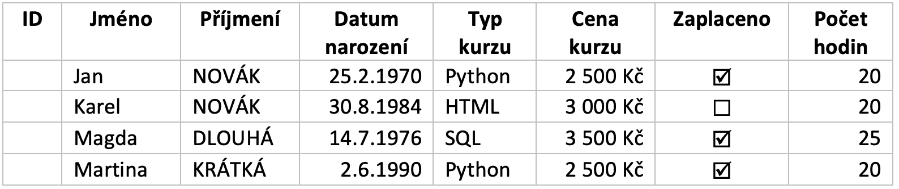
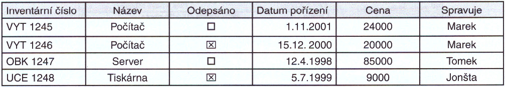
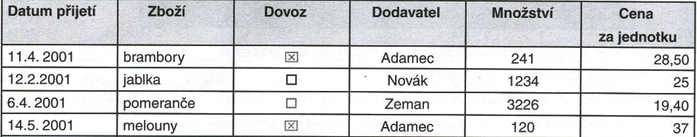

# Cvičení (SQLite)

Pomocí aplikace **DB Browser (SQLite)** vytvořte určenou databázi.

- Název tabulky bude stejný jako databáze
- Názvy sloupců (polí) co nejkratší a bez dikritiky (např. `Název výrobku` -> `vyrobek`).
- První sloupec bude `id` s primárním klíčem
- Pozor na tvar datumu `YYYY-MM-DD`
- Booleovaké hodnoty (`True`/`False`) se kódují na `1`/`0`.
- Tabulku s daty exportujte do `.csv` se stejnáým názvem.

Databázi i CSV soubor odevzdejte podle pokynů.

## (1) Databáze `kurzy`

## (2) Databáze `majetek`

## (3) Databáze `obchod`

